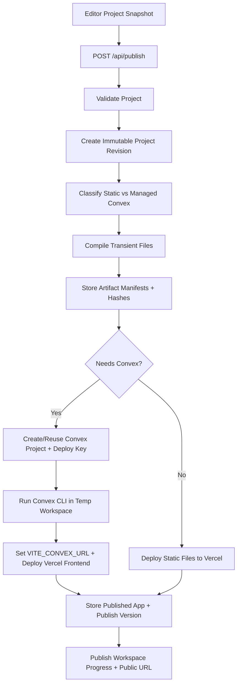

# Managed Convex + Vercel Publishing Implementation Plan

> **For agentic workers:** REQUIRED SUB-SKILL: Use superpowers:subagent-driven-development (recommended) or superpowers:executing-plans to implement this plan task-by-task. Steps use checkbox (`- [ ]`) syntax for tracking.

**Goal:** Build a managed publishing pipeline where Page Builder deploys user apps to Vercel frontends and Convex backends owned by our platform accounts.

**Architecture:** The builder keeps `Project` as the source of truth. Publishing is a server-side control-plane workflow: validate the project snapshot, compile transient deployable files, provision/reuse Convex and Vercel resources, deploy, then store the resource mapping outside the user project document. User-facing "Export React project" is not the product path.

**Tech Stack:** React 19, Vite, Zustand, Bun server, TypeScript, Convex Platform/Management APIs, Convex CLI, Vercel REST API, Bun tests.

---

## Investigation Summary

Current code state:

- `src/core/publisher/*` exports static HTML ZIPs.
- `src/core/react-publisher/*` exports a downloadable Vite React project, but it is not a reliable publish architecture.
- `src/modules/base/root.tsx` has `render()` but no `toJsx()`, which explains the current "page root is not compatible with React export" failure.
- `ProjectExplorerPanel` now exposes product concepts: pages, visual components, styles, assets, scripts.
- `project.files[]` still represents code-like files, but managed publishing must not treat arbitrary user-authored scripts/config as trusted server/build code.
- `server/index.ts` is currently an agent-only Bun API server. Managed publishing needs a real control-plane API.

Provider facts from official docs:

- Convex Platform APIs support products that create/manage Convex projects in the platform owner's team, and Convex recommends using a separate service account token for this model: https://docs.convex.dev/platform-apis
- Convex Management API can provision projects/deployments, and deploy keys can be created for deployment-specific CLI access: https://docs.convex.dev/management-api and https://docs.convex.dev/management-api/create-deploy-key
- Convex recommends pushing code programmatically with the Convex CLI because the CLI handles bundling and deployment details: https://docs.convex.dev/platform-apis
- Convex React clients should receive `VITE_CONVEX_URL` in Vite apps: https://docs.convex.dev/client/react/deployment-urls
- Convex supports dashboard Backup & Restore, periodic backups, and destructive restore workflows that should be treated as data recovery, not normal app rollback: https://docs.convex.dev/database/backup-restore
- Vercel REST APIs can create projects, create env vars, create file-based deployments, and add custom domains: https://vercel.com/docs/rest-api/reference/endpoints/projects/create-a-new-project, https://docs.vercel.com/docs/rest-api/reference/endpoints/projects/create-one-or-more-environment-variables, https://vercel.com/docs/rest-api/reference/endpoints/deployments/create-a-new-deployment, https://vercel.com/docs/rest-api/reference/endpoints/projects/add-a-domain-to-a-project
- Vercel has deployment rollback/promotion semantics for frontends, but environment variables and external systems such as databases are separate concerns during rollback: https://vercel.com/docs/instant-rollback
- GitHub REST APIs can create repositories, update repository contents, and write raw Git objects/refs if we later add optional generated-source mirroring: https://docs.github.com/en/rest/repos/repos, https://docs.github.com/en/rest/repos/contents, https://docs.github.com/en/rest/git

## Product Boundary

Managed publishing v1 includes:

- Static publish: generated HTML/CSS/assets deployed to Vercel.
- Dynamic publish: generated React/Vite frontend deployed to Vercel plus generated Convex backend deployed to a Convex project in our team.
- One Vercel project per published user app.
- One Convex project per dynamic published user app.
- Project-level workspace navigation across Editor, Database, content/resources, users, commerce, and publishing areas.
- Visual data modeling inside the builder: users define tables, fields, indexes, permissions, and optional seed records without editing generated Convex files.
- Resource management for tables such as Posts, Products, Users, and Orders through generated builder workspaces.
- Data-aware page building: users bind UI modules to tables/queries/forms through editor controls.
- Provider secrets live only on the server/control plane.
- The Project Explorer remains concept-based; generated files are transient build artifacts and are not shown to users.

Managed publishing v1 excludes:

- User-owned Vercel/Convex account connections.
- Self-hosted publish.
- Custom domains as a first milestone.
- Arbitrary user-authored backend code.
- A raw Convex dashboard clone. Users manage data through builder-specific schema/resource screens, not by editing generated Convex internals.
- Treating `project.files[]` scripts/config as executable build-time source in our managed Vercel account.
- Downloadable React project export as a supported product feature.

## Product Entry Model

Users enter the builder from our website/dashboard:

```text
Marketing website -> Dashboard -> Project Builder -> Publish
```

Publishing always calls our control-plane API. The browser never talks directly to Vercel or Convex provider APIs. Our platform account owns the Vercel projects and Convex projects for managed publishing, while the user's project document remains the editable source model inside the builder.

Later self-hosting should be a separate product path: export or mirror generated source, give the user environment requirements, and let them deploy into their own accounts. That path should not shape the first managed-publish architecture.

## Builder UX Model

The builder should expose product concepts, not generated files. Users should understand the app through project-level workspaces:

- **Editor:** canvas, pages, components, styles, assets, scripts.
- **Database:** schema/tables/fields/indexes/permissions.
- **Resources:** content and operational records such as Posts, Products, Users, Orders, Bookings, Events.
- **Publish:** deploy status, domains later, deployment history.

Generated files such as `convex/schema.ts`, `convex/posts.ts`, `src/main.tsx`, and route components are build artifacts. They are inspectable later through an advanced diagnostics view, but they are not the primary editing interface.

### Project Workspace Navigation

Add a horizontal project-level navigation at the top of the builder project route. It should use the same visual language as the left panel rail: compact icon buttons, active indicator, concise tooltips, restrained accent colors, and no large tab cards.

This navigation changes the current project workspace/page. It is not part of the canvas editor and it must stay mounted when moving between the Editor, Database, resource, and Publish pages.

Example:

```text
[Editor] [Database] [Posts] [Users] [Orders] [Publish]
```

Navigation rules:

- **Editor** opens the normal canvas/editor workspace and is the only workspace that mounts `CanvasRoot`, `LeftSidebar`, `RightSidebar`, canvas overlays, and editor-specific toolbar controls.
- **Database** opens the schema designer.
- **Posts**, **Products**, **Orders**, and similar items are resource workspaces generated from the project's data model and feature templates.
- **Users** appears when auth/user management is enabled.
- **Orders** appears when commerce/order features are enabled.
- If a project has many tables, only pinned or feature-level resources appear in the top nav; the rest live in the Database workspace's resource list or an overflow menu.

Route model:

```text
/projects/:projectId/editor
/projects/:projectId/database
/projects/:projectId/resources/:tableSlug
/projects/:projectId/publish
```

The current `/editor/:projectId` route should be replaced rather than preserved. This is a new project and there is no backward-compatibility requirement.

This is a better mental model than putting tables inside Project Explorer. Project Explorer remains about the build-time project structure, while the top project nav represents the app's runtime/business areas.

### Project Explorer

Keep Project Explorer focused on build structure:

```text
Project
  Pages
    Home        /
    Blog        /blog
  Components
    Card
    Navbar
  Styles
  Assets
  Scripts
```

Do not put tables or generated backend files here. The Project Explorer answers "what pages/components/assets make up this app?" The Database and resource workspaces answer "what data does this app store and manage?"

### Database Workspace

The Database workspace should be a focused schema designer, not a code editor. It should have a left resource list and a main table editor.

The table editor should have three tabs:

- **Fields:** field name, type, required/optional, default value, relation target, list/array toggle.
- **Indexes:** user-visible query indexes such as `by_slug`, `by_author`, `by_status`. Convex indexes are defined in `schema.ts`, so this must be structured data, not text.
- **Permissions:** public/authenticated/owner rules for read/create/update/delete.

Field types for v1:

```ts
type DataFieldType =
  | 'string'
  | 'number'
  | 'boolean'
  | 'date'
  | 'text'
  | 'richText'
  | 'image'
  | 'file'
  | 'relation'
  | 'json'
```

The generated Convex schema maps these to validators from `convex/values`. Convex schemas are optional but useful for type safety and correct generated function APIs, and indexes are defined as part of the schema. See Convex schema/index docs: https://docs.convex.dev/database/schemas and https://docs.convex.dev/database/reading-data/indexes/

### Resource Workspaces

Resource workspaces are where users add and manage records. Examples:

- **Posts:** list posts, create post, edit title/slug/body/status/author/cover image.
- **Users:** view app users, roles, profile fields, and permission-related metadata.
- **Orders:** view orders, statuses, customer relation, line items, totals.
- **Products:** manage catalog records, images, prices, inventory fields.

Resource workspaces are generated from table definitions and optional feature templates. They should feel like a small admin app inside the builder: dense lists, filters, detail editor, create button, and status indicators. This is separate from Database because users should not edit schema every time they want to write a post.

V1 data behavior:

- Before first publish, resource records are stored in `project.data.tables[].seedRecords` and power editor preview.
- On first managed Convex publish, seed records can be pushed into Convex through a generated setup function.
- After publish, resource workspaces should be able to read/write live Convex data for the published app when the user chooses "Edit live data". If live-data editing is not implemented in the first release slice, the UI must label records as preview/seed data.

### Data Binding UX

Users need two ways to use table data in pages:

1. **Data-bound modules:** purpose-built modules such as Collection List, Detail View, and Form.
2. **Property bindings:** any normal module prop can be bound to a field from the current data context.

V1 should prefer data-bound modules because they are more understandable and easier to generate safely:

- **Collection List:** choose table, sort/index, optional filter, item layout component.
- **Detail View:** choose table and lookup field, usually slug or document id.
- **Form:** choose table and operation, create/update record, map inputs to fields.

Property bindings come next:

```text
Text module
  Text: [Bind] Posts.title

Image module
  Source: [Bind] Posts.coverImage

Button module
  Link: [Bind] /blog/${Posts.slug}
```

Bindings must be structured expressions, not arbitrary JavaScript. The compiler converts them into generated Convex queries/mutations and typed React code.

### Publishing UX

Publishing should be a full project workspace plus a shortcut from the Editor toolbar:

- Project nav item: **Publish**
- Editor toolbar shortcut: **Publish** opens `/projects/:projectId/publish`
- Primary screen title: **Publish**
- Mode is inferred:
  - no data/backend features -> Static
  - data tables/forms/auth/actions -> Managed Convex
- Publish screen shows:
  - destination: managed Vercel
  - backend: none or managed Convex
  - diagnostics: missing fields, unsupported modules, unsafe scripts, unpublished assets
  - action: Publish / Republish / Retry failed step
  - result: public Vercel URL

The publish screen should feel like a deployment cockpit, not a modal:

- **Preflight panel:** static vs managed Convex mode, diagnostics, unsupported features, and estimated target resources.
- **Progress timeline:** queued, validating, compiling, provisioning Convex, deploying Convex, provisioning Vercel, deploying Vercel, ready/failed.
- **Live log drawer:** sanitized server logs, collapsed by default, no provider tokens or deploy keys.
- **Result panel:** public URL, last publish time, version number, mode, and "Open site".
- **Version history:** previous published versions, frontend deployment status, backend deployment status, and rollback/redeploy actions.
- **Settings area:** custom domains, unpublish/delete, provider resource cleanup, and quotas later.

Settings > Publishing should not be the main management view. If a settings section remains, it should only show a compact summary and a button that opens the Publish workspace.

The publish UI must never expose deploy keys, provider tokens, or internal Convex/Vercel IDs.

### Versioning And GitHub

Use internal versioning for v1. Do not require GitHub to publish.

The builder should create immutable snapshots whenever the user publishes:

- **Project revision:** the full validated project document at publish time.
- **Frontend artifact manifest:** generated Vercel file map hash, build mode, and generated dependency versions.
- **Backend artifact manifest:** generated Convex file map hash, schema version, function version, and seed/migration plan hash.
- **Provider deployment record:** Vercel deployment id/url/status, Convex project/deployment name, Convex URL, and publish job id.

Rollback model:

- V1 rollback should republish a selected internal version as a new latest version. That keeps history immutable and works the same way for static and managed Convex apps.
- Frontend rollback uses Vercel's deployment promotion/rollback model.
- Backend code rollback redeploys a previous generated Convex backend artifact from our internal snapshot.
- Data rollback uses Convex backups only for destructive recovery. It should not be used for ordinary "undo this publish" because restoring data wipes/replaces existing data.
- Schema changes that can destroy data require an explicit preflight warning and an automatic backup step once the Convex backup APIs/workflow for our account model are implemented.

GitHub should be optional later, not a dependency of the managed publish path:

- **Good v2 use:** mirror generated source to a platform-owned private repo for audit/export, or create a user-owned repo when they choose "Export source".
- **Bad v1 use:** require every publish to flow through GitHub. That adds OAuth, repo lifecycle, branch conflicts, and generated-code synchronization before the core publish pipeline is stable.
- **Self-hosting use:** GitHub becomes valuable when users want to take ownership of the generated app source and deploy it outside our managed Vercel/Convex accounts.

## Control Plane Model

There are two Convex layers:

1. **Builder control Convex project:** our product backend. Stores users, builder projects, publish jobs, published app records, provider resource IDs, deployment history, and audit events.
2. **Generated app Convex projects:** one per dynamic published app. Stores that app's data and generated functions.

Do not store provider tokens, deploy keys, or app deployment secrets in the browser state or in the exported `Project` document. The `Project` document may store harmless UI metadata like last published URL, but canonical resource mappings belong in the control plane.

Suggested control-plane record shape:

```ts
export type PublishStatus =
  | 'queued'
  | 'validating'
  | 'compiling'
  | 'provisioning_convex'
  | 'deploying_convex'
  | 'provisioning_vercel'
  | 'deploying_vercel'
  | 'ready'
  | 'failed'

export interface PublishedAppRecord {
  id: string
  ownerUserId: string
  builderProjectId: string
  mode: 'static' | 'managed-convex'
  currentVersionId?: string
  vercelProjectId: string
  vercelProjectName: string
  vercelDeploymentId?: string
  vercelUrl?: string
  convexProjectId?: string
  convexProjectSlug?: string
  convexDeploymentName?: string
  convexCloudUrl?: string
  createdAt: number
  updatedAt: number
}

export interface ProjectRevisionRecord {
  id: string
  ownerUserId: string
  builderProjectId: string
  version: number
  projectSnapshot: unknown
  projectSnapshotHash: string
  createdAt: number
}

export interface PublishVersionRecord {
  id: string
  publishedAppId: string
  builderProjectId: string
  projectRevisionId: string
  version: number
  mode: 'static' | 'managed-convex'
  status: 'ready' | 'failed' | 'rolled_back' | 'superseded'
  frontendArtifactHash: string
  backendArtifactHash?: string
  vercelDeploymentId?: string
  vercelUrl?: string
  convexDeploymentName?: string
  convexCloudUrl?: string
  publishJobId: string
  createdAt: number
}
```

Suggested project data-model shape:

```ts
export interface ProjectDataModel {
  tables: DataTable[]
}

export interface DataTable {
  id: string
  name: string
  slug: string
  fields: DataField[]
  indexes: DataIndex[]
  permissions: DataPermissionPolicy
  seedRecords: DataSeedRecord[]
  createdAt: number
  updatedAt: number
}

export interface DataField {
  id: string
  name: string
  type: DataFieldType
  required: boolean
  list: boolean
  relation?: { tableId: string; cardinality: 'one' | 'many' }
  defaultValue?: unknown
}

export interface DataIndex {
  id: string
  name: string
  fields: string[]
}

export interface DataPermissionPolicy {
  read: 'public' | 'authenticated' | 'owner'
  create: 'public' | 'authenticated' | 'owner'
  update: 'authenticated' | 'owner'
  delete: 'authenticated' | 'owner'
}

export interface DataSeedRecord {
  id: string
  values: Record<string, unknown>
}
```

This should live under `project.data`, not `project.files`. The compiler owns conversion from `project.data` into Convex files.

## Publish Flow



## File Structure

Create:

- `src/core/publishing/types.ts` - pure shared publishing types.
- `src/core/publishing/classifyProject.ts` - decides static vs managed Convex requirements from project features.
- `src/core/publishing/compileStaticSite.ts` - converts `Project` to static file map for Vercel.
- `src/core/publishing/compileReactSite.ts` - converts `Project` to generated Vite React file map.
- `src/core/publishing/compileConvexBackend.ts` - generates `convex/schema.ts`, queries, mutations, actions, and optional `http.ts`.
- `src/core/publishing/fileMap.ts` - helpers for UTF-8/base64 deployment files.
- `src/core/publishing/versioning.ts` - hashes project snapshots/artifact manifests and assigns publish version numbers.
- `src/core/data-model/types.ts` - structured tables, fields, indexes, permissions, seed records, and bindings.
- `src/core/data-model/validation.ts` - validates table/field/index names, duplicate fields, invalid relations, and unsupported seed values.
- `src/core/editor-store/slices/dataModelSlice.ts` - CRUD for tables, fields, indexes, permissions, and seed records.
- `src/core/editor-store/slices/projectWorkspaceSlice.ts` - pinned resources and workspace preferences; active workspace comes from the route.
- `src/app/ProjectBuilderLayout.tsx`
- `src/app/ProjectBuilderLayout.module.css`
- `src/app/components/ProjectWorkspaceNav/ProjectWorkspaceNav.tsx`
- `src/app/components/ProjectWorkspaceNav/ProjectWorkspaceNav.module.css`
- `src/app/workspaces/DatabaseWorkspace/DatabaseWorkspace.tsx`
- `src/app/workspaces/DatabaseWorkspace/DatabaseWorkspace.module.css`
- `src/app/workspaces/DatabaseWorkspace/FieldsTab.tsx`
- `src/app/workspaces/DatabaseWorkspace/IndexesTab.tsx`
- `src/app/workspaces/DatabaseWorkspace/PermissionsTab.tsx`
- `src/app/workspaces/ResourceWorkspace/ResourceWorkspace.tsx`
- `src/app/workspaces/ResourceWorkspace/ResourceWorkspace.module.css`
- `src/editor/components/DataBinding/DataBindingControl.tsx`
- `src/editor/components/DataBinding/dataBindingTypes.ts`
- `src/app/workspaces/PublishWorkspace/PublishWorkspace.tsx`
- `src/app/workspaces/PublishWorkspace/PublishWorkspace.module.css`
- `src/app/workspaces/PublishWorkspace/PublishProgressTimeline.tsx`
- `src/app/workspaces/PublishWorkspace/PublishVersionHistory.tsx`
- `server/publishing/env.ts` - reads and validates provider env vars.
- `server/publishing/convexPlatformClient.ts` - Convex Management/Deployment API wrapper.
- `server/publishing/vercelClient.ts` - Vercel REST API wrapper.
- `server/publishing/workspace.ts` - temp directory writer and command runner for Convex CLI.
- `server/publishing/publishService.ts` - orchestration state machine.
- `server/publishing/versionStore.ts` - persists revision/version/provider deployment records.
- `server/publishHandler.ts` - HTTP handlers for publish/create/status.
- `src/editor/components/Toolbar/PublishButton.tsx`
- `src/core/editor-store/slices/publishingSlice.ts`
- `src/__tests__/publishing/*.test.ts`
- `src/__tests__/server/publishing/*.test.ts`

Modify:

- `src/modules/base/root.tsx` - add trusted `toJsx()` for managed React generation.
- `src/core/page-tree/types.ts` - add optional `data?: ProjectDataModel` and structured prop binding references.
- `src/core/persistence/validate.ts` - validate and hydrate `project.data`.
- `src/core/editor-store/store.ts` - add `publishingSlice`.
- `src/app/router.ts` - replace `/editor/:projectId` with project workspace routes under `/projects/:projectId/*`.
- `src/app/EditorLayout.tsx` - keep canvas/editor-only UI here; remove project-level navigation responsibilities from this component.
- `src/editor/components/Toolbar/Toolbar.tsx` - replace user-facing React export with Publish shortcut to the Publish workspace.
- `src/editor/components/Toolbar/ExportButton.tsx` - keep static download only or move behind a secondary "Download HTML" action.
- `src/editor/components/ProjectExplorerPanel/ProjectExplorerPanel.tsx` - keep pages/components/styles/assets/scripts only.
- `src/editor/components/PropertiesPanel/PropertiesPanel.tsx` - expose binding controls where prop controls support data binding.
- `server/index.ts` - route `/api/publish` and `/api/publish/:jobId`.
- `package.json` - add `convex`, `@convex-dev/platform`, and `@vercel/sdk` only when the implementation actually uses SDKs instead of raw `fetch`.

## Tasks

### Task 1: Remove Broken React Export From Product Surface

**Files:**
- Modify: `src/editor/components/Toolbar/ExportButton.tsx`
- Modify: `src/editor/components/Toolbar/Toolbar.tsx`
- Test: `src/__tests__/toolbar/exportButton.test.tsx`

- [ ] Write a failing test that the export menu no longer offers "React Project".
- [ ] Change the export UI to expose only "Download HTML" until managed publish is implemented.
- [ ] Keep `src/core/react-publisher/*` in place as internal compiler code for now.
- [ ] Run `bun test src/__tests__/toolbar/exportButton.test.tsx`.

### Task 2: Fix the Immediate React Compiler Root Defect

**Files:**
- Modify: `src/modules/base/root.tsx`
- Test: `src/__tests__/react-publisher/rootModule.test.ts`

- [ ] Write a failing test that a page containing only `base.root` compiles without the text `does not support React export`.
- [ ] Add `toJsx: (_props, renderedChildren) => \`<div className="${MODULE_CLASS}">${renderedChildren.join('')}</div>\`` to `RootModule`.
- [ ] Ensure the generated root imports or emits CSS consistently with the managed React compiler.
- [ ] Run `bun test src/__tests__/react-publisher/rootModule.test.ts`.

### Task 3: Introduce Publishing Domain Types

**Files:**
- Create: `src/core/publishing/types.ts`
- Test: `src/__tests__/publishing/types.test.ts`

- [ ] Define `PublishMode = 'static' | 'managed-convex'`.
- [ ] Define `PublishFile` as `{ path: string; data: string | Uint8Array; encoding: 'utf8' | 'base64' | 'binary' }`.
- [ ] Define `PublishBundle` as `{ mode: PublishMode; files: PublishFile[]; buildCommand?: string; outputDirectory?: string; requiredEnv: string[] }`.
- [ ] Define `PublishDiagnostic` as `{ level: 'error' | 'warning'; code: string; message: string; path?: string }`.
- [ ] Define `PublishCompileResult` as `{ ok: true; bundle: PublishBundle; diagnostics: PublishDiagnostic[] } | { ok: false; diagnostics: PublishDiagnostic[] }`.
- [ ] Run `bun test src/__tests__/publishing/types.test.ts`.

### Task 4: Classify Projects Before Publishing

**Files:**
- Create: `src/core/publishing/classifyProject.ts`
- Test: `src/__tests__/publishing/classifyProject.test.ts`

- [ ] Static projects are the default.
- [ ] Managed Convex is required when the project later contains data models, generated forms bound to data, authenticated user areas, server actions, scheduled jobs, or Convex file storage references.
- [ ] For current UI state, all normal page/component/style/asset projects classify as `static` unless the user explicitly chooses managed Convex.
- [ ] Return warnings when scripts/config files exist because v1 managed publishing will not execute arbitrary user-authored source.
- [ ] Run `bun test src/__tests__/publishing/classifyProject.test.ts`.

### Task 4A: Add Project Data Model Types

**Files:**
- Create: `src/core/data-model/types.ts`
- Create: `src/core/data-model/validation.ts`
- Modify: `src/core/page-tree/types.ts`
- Modify: `src/core/persistence/validate.ts`
- Test: `src/__tests__/data-model/validation.test.ts`

- [ ] Add `ProjectDataModel`, `DataTable`, `DataField`, `DataIndex`, `DataPermissionPolicy`, and `DataSeedRecord`.
- [ ] Add `data?: ProjectDataModel` to `Project`.
- [ ] Validate table names as user-friendly labels plus stable slugs.
- [ ] Validate field names as safe identifiers.
- [ ] Reject duplicate table slugs and duplicate field names.
- [ ] Reject indexes referencing missing fields.
- [ ] Reject relation fields referencing missing tables.
- [ ] Hydrate missing `project.data` as `{ tables: [] }`.
- [ ] Run `bun test src/__tests__/data-model/validation.test.ts`.

### Task 4B: Add Data Model Store Slice

**Files:**
- Create: `src/core/editor-store/slices/dataModelSlice.ts`
- Modify: `src/core/editor-store/store.ts`
- Test: `src/__tests__/data-model/dataModelSlice.test.ts`

- [ ] Add `createTable(name)`.
- [ ] Add `renameTable(tableId, name)`.
- [ ] Add `deleteTable(tableId)` with relation cleanup diagnostics.
- [ ] Add `addField(tableId, field)`.
- [ ] Add `updateField(tableId, fieldId, patch)`.
- [ ] Add `deleteField(tableId, fieldId)` with index cleanup.
- [ ] Add `addIndex(tableId, index)`.
- [ ] Add `deleteIndex(tableId, indexId)`.
- [ ] Add seed record CRUD.
- [ ] Ensure all mutations participate in undo/redo and mark unsaved changes.
- [ ] Run `bun test src/__tests__/data-model/dataModelSlice.test.ts`.

### Task 4C: Add Project Workspace Routing And Top Navigation

**Files:**
- Create: `src/core/editor-store/slices/projectWorkspaceSlice.ts`
- Modify: `src/core/editor-store/store.ts`
- Create: `src/app/ProjectBuilderLayout.tsx`
- Create: `src/app/ProjectBuilderLayout.module.css`
- Create: `src/app/components/ProjectWorkspaceNav/ProjectWorkspaceNav.tsx`
- Create: `src/app/components/ProjectWorkspaceNav/ProjectWorkspaceNav.module.css`
- Modify: `src/app/router.ts`
- Modify: `src/app/EditorLayout.tsx`
- Test: `src/__tests__/workspace/projectWorkspaceNav.test.tsx`

- [ ] Replace `/editor/:projectId` with `/projects/:projectId/editor`, `/projects/:projectId/database`, `/projects/:projectId/resources/:tableSlug`, and `/projects/:projectId/publish`.
- [ ] Move project loading/persistence that all workspaces need into `ProjectBuilderLayout`, so Database and Publish can use the project without mounting the canvas.
- [ ] Derive active workspace from React Router location/params.
- [ ] Use `projectWorkspaceSlice` only for pinned resources and workspace preferences.
- [ ] Render compact icon nav with Editor, Database, resource shortcuts, and Publish.
- [ ] Derive resource shortcuts from pinned data tables and enabled feature templates.
- [ ] Keep the nav visually aligned with the left panel rail style.
- [ ] Switching to Editor renders `EditorLayout` and mounts canvas/editor-only UI.
- [ ] Switching to Database renders the Database workspace with no canvas mounted.
- [ ] Switching to a resource renders the Resource workspace for that table with no canvas mounted.
- [ ] Switching to Publish renders the Publish workspace with no canvas mounted.
- [ ] Do not add data tables to Project Explorer.
- [ ] Run `bun test src/__tests__/workspace/projectWorkspaceNav.test.tsx`.

### Task 4D: Add Database Workspace

**Files:**
- Create: `src/app/workspaces/DatabaseWorkspace/DatabaseWorkspace.tsx`
- Create: `src/app/workspaces/DatabaseWorkspace/DatabaseWorkspace.module.css`
- Create: `src/app/workspaces/DatabaseWorkspace/FieldsTab.tsx`
- Create: `src/app/workspaces/DatabaseWorkspace/IndexesTab.tsx`
- Create: `src/app/workspaces/DatabaseWorkspace/PermissionsTab.tsx`
- Test: `src/__tests__/data-model/databaseWorkspace.test.tsx`

- [ ] Render as the full main workspace at `/projects/:projectId/database`.
- [ ] Show a left list of tables with create/rename/delete actions.
- [ ] Fields tab supports add/rename/delete fields, type selection, required toggle, list toggle, default value, and relation target.
- [ ] Indexes tab supports add/delete index and field ordering.
- [ ] Permissions tab supports read/create/update/delete policies.
- [ ] Display validation errors inline.
- [ ] Do not expose generated `schema.ts`.
- [ ] Run `bun test src/__tests__/data-model/databaseWorkspace.test.tsx`.

### Task 4E: Add Data Binding Controls

**Files:**
- Create: `src/editor/components/DataBinding/DataBindingControl.tsx`
- Create: `src/editor/components/DataBinding/dataBindingTypes.ts`
- Modify: `src/editor/components/PropertiesPanel/PropertyControlRenderer.tsx`
- Test: `src/__tests__/data-binding/dataBindingControl.test.tsx`

- [ ] Add a binding affordance next to supported text, image, URL, and richtext controls.
- [ ] Let users pick table, field, and optional current item context.
- [ ] Store bindings as structured references on node props or a dedicated `node.bindings` object.
- [ ] Do not allow arbitrary JavaScript expressions.
- [ ] Show a clear missing-field diagnostic if a bound field is deleted.
- [ ] Run `bun test src/__tests__/data-binding/dataBindingControl.test.tsx`.

### Task 4F: Add Data-Bound Modules

**Files:**
- Create: `src/modules/base/dataCollection/index.tsx`
- Create: `src/modules/base/dataDetail/index.tsx`
- Create: `src/modules/base/dataForm/index.tsx`
- Test: `src/__tests__/modules/dataModules.test.tsx`

- [ ] Add Collection List module with table, index/sort, filter, and child item layout support.
- [ ] Add Detail View module with table and lookup field support.
- [ ] Add Form module with create/update mode and field mapping.
- [ ] In editor preview, use seed records.
- [ ] In managed publish, compile these modules to Convex query/mutation usage.
- [ ] Static export should show seed-preview HTML and a warning that live data requires managed Convex.
- [ ] Run `bun test src/__tests__/modules/dataModules.test.tsx`.

### Task 4G: Add Resource Workspaces For Records

**Files:**
- Create: `src/app/workspaces/ResourceWorkspace/ResourceWorkspace.tsx`
- Create: `src/app/workspaces/ResourceWorkspace/ResourceWorkspace.module.css`
- Test: `src/__tests__/data-model/resourceWorkspace.test.tsx`

- [ ] Render as the full main workspace at `/projects/:projectId/resources/:tableSlug`.
- [ ] Show records for the active table as a dense list/table.
- [ ] Add "New record" action.
- [ ] Add record detail editor generated from table fields.
- [ ] Store pre-publish records as `seedRecords`.
- [ ] Clearly label seed/preview records before live Convex editing exists.
- [ ] Support pinned table resources so Posts, Users, Orders, Products can appear in the top nav.
- [ ] Run `bun test src/__tests__/data-model/resourceWorkspace.test.tsx`.

### Task 5: Compile Static Site Files For Vercel

**Files:**
- Create: `src/core/publishing/compileStaticSite.ts`
- Create: `src/core/publishing/fileMap.ts`
- Test: `src/__tests__/publishing/compileStaticSite.test.ts`

- [ ] Use existing `publishPage()` for HTML.
- [ ] Emit `/index.html` for slug `index`.
- [ ] Emit `/<slug>/index.html` for non-index pages.
- [ ] Emit uploaded assets under their public paths.
- [ ] Emit user styles only when they are safe CSS text assets.
- [ ] Emit a minimal `vercel.json` only when SPA/static routing requires it.
- [ ] Do not emit scripts/config as executable build files in managed v1.
- [ ] Run `bun test src/__tests__/publishing/compileStaticSite.test.ts`.

### Task 6: Compile Managed React Frontend Files

**Files:**
- Create: `src/core/publishing/compileReactSite.ts`
- Modify: `src/core/react-publisher/scaffold.ts` if reusable scaffold changes belong there.
- Test: `src/__tests__/publishing/compileReactSite.test.ts`

- [ ] Generate transient Vite React files with `convex` dependency when mode is `managed-convex`.
- [ ] Generate `src/main.tsx` with `ConvexReactClient(import.meta.env.VITE_CONVEX_URL)` and `ConvexProvider` only for managed Convex mode.
- [ ] Generate route files from pages using the React compiler.
- [ ] Generate visual component files from `project.visualComponents`.
- [ ] Generate shared project CSS for class CSS, tokens, and global styles.
- [ ] Exclude arbitrary user scripts/config from source execution.
- [ ] Run `bun test src/__tests__/publishing/compileReactSite.test.ts`.

### Task 7: Compile Convex Backend Files

**Files:**
- Create: `src/core/publishing/compileConvexBackend.ts`
- Test: `src/__tests__/publishing/compileConvexBackend.test.ts`

- [ ] Generate `convex/schema.ts` from a structured internal data model, starting with an empty schema when no data model exists.
- [ ] Generate `convex/health.ts` with a query returning deployment health metadata.
- [ ] Generate `convex/appConfig.ts` with public app metadata needed by the frontend.
- [ ] Generate generated CRUD functions only from structured data definitions, not arbitrary user code.
- [ ] Generate `convex/http.ts` only when the app uses webhooks/public HTTP routes.
- [ ] Generate table schema from `project.data.tables`.
- [ ] Generate indexes from `DataIndex`.
- [ ] Generate query functions for Collection List and Detail View usages.
- [ ] Generate mutation functions for Form usages.
- [ ] Generate seed setup function for initial deployment when seed records exist.
- [ ] Generate authorization checks from `DataPermissionPolicy`.
- [ ] Run `bun test src/__tests__/publishing/compileConvexBackend.test.ts`.

### Task 8: Add Provider Environment Validation

**Files:**
- Create: `server/publishing/env.ts`
- Test: `src/__tests__/server/publishing/env.test.ts`

- [ ] Require `CONVEX_TEAM_ID`.
- [ ] Require `CONVEX_TEAM_TOKEN`.
- [ ] Require `VERCEL_TOKEN`.
- [ ] Require either `VERCEL_TEAM_ID` or `VERCEL_TEAM_SLUG`.
- [ ] Never expose these values to the browser.
- [ ] Return typed configuration objects to server-only modules.
- [ ] Run `bun test src/__tests__/server/publishing/env.test.ts`.

### Task 9: Implement Convex Platform Client

**Files:**
- Create: `server/publishing/convexPlatformClient.ts`
- Test: `src/__tests__/server/publishing/convexPlatformClient.test.ts`

- [ ] Implement `createProject({ name })` against `/teams/:team_id/create_project`.
- [ ] Implement `createDeployment({ projectId })` against `/projects/:project_id/create_deployment` if project creation did not provision prod.
- [ ] Implement `createDeployKey({ deploymentName })` against `/deployments/:deployment_name/create_deploy_key`.
- [ ] Implement deployment URL lookup using Convex deployment info/canonical URL APIs or deployment metadata returned during provisioning.
- [ ] Add retry only for documented safe retry cases.
- [ ] Unit test with mocked `fetch`.
- [ ] Run `bun test src/__tests__/server/publishing/convexPlatformClient.test.ts`.

### Task 10: Implement Vercel Client

**Files:**
- Create: `server/publishing/vercelClient.ts`
- Test: `src/__tests__/server/publishing/vercelClient.test.ts`

- [ ] Implement `createProject({ name })`.
- [ ] Implement env var upsert for `VITE_CONVEX_URL`.
- [ ] Implement file-based deployment using generated file map.
- [ ] Store returned deployment id and URL.
- [ ] Implement custom-domain helper later but keep it outside the first publish path.
- [ ] Unit test with mocked `fetch`.
- [ ] Run `bun test src/__tests__/server/publishing/vercelClient.test.ts`.

### Task 11: Implement Temp Workspace And Convex CLI Push

**Files:**
- Create: `server/publishing/workspace.ts`
- Test: `src/__tests__/server/publishing/workspace.test.ts`

- [ ] Create a temp directory per publish job.
- [ ] Write generated files to disk.
- [ ] Run `npx convex deploy` with `CONVEX_DEPLOY_KEY` in the child process env.
- [ ] Capture stdout/stderr in publish job logs.
- [ ] Always clean temp directories after success/failure.
- [ ] Do not run arbitrary user scripts.
- [ ] Run `bun test src/__tests__/server/publishing/workspace.test.ts`.

### Task 12: Implement Publish Service State Machine

**Files:**
- Create: `server/publishing/publishService.ts`
- Create: `src/core/publishing/versioning.ts`
- Test: `src/__tests__/server/publishing/publishService.test.ts`

- [ ] Accept a validated project snapshot and requested mode.
- [ ] Create a publish job id.
- [ ] Move through statuses: validating, compiling, provisioning, deploying, ready/failed.
- [ ] Create an immutable project revision before compiling.
- [ ] Hash generated frontend and backend artifact manifests.
- [ ] Reuse existing published app resources when publishing the same builder project again.
- [ ] Create a new publish version for every completed publish attempt.
- [ ] Record publish diagnostics and provider logs.
- [ ] Return a stable public URL on success.
- [ ] Run `bun test src/__tests__/server/publishing/publishService.test.ts`.

### Task 12A: Add Publish Version Store

**Files:**
- Create: `server/publishing/versionStore.ts`
- Test: `src/__tests__/server/publishing/versionStore.test.ts`

- [ ] Persist `ProjectRevisionRecord`.
- [ ] Persist `PublishVersionRecord`.
- [ ] Persist provider deployment records without exposing raw provider secrets.
- [ ] Mark older successful versions as `superseded` when a new version becomes ready.
- [ ] Support listing publish versions for the Publish workspace.
- [ ] Support selecting a previous version for frontend rollback or backend artifact redeploy.
- [ ] Run `bun test src/__tests__/server/publishing/versionStore.test.ts`.

### Task 13: Add Publish HTTP API

**Files:**
- Create: `server/publishHandler.ts`
- Modify: `server/index.ts`
- Test: `src/__tests__/server/publishHandler.test.ts`

- [ ] Add `POST /api/publish`.
- [ ] Add `GET /api/publish/:jobId`.
- [ ] Add `GET /api/projects/:projectId/publish/versions`.
- [ ] Add `POST /api/projects/:projectId/publish/versions/:versionId/redeploy` to republish a previous internal version as the newest version.
- [ ] Validate request size and JSON shape.
- [ ] Use existing `validateProject()` before compiling.
- [ ] Return sanitized errors to the browser and keep provider logs server-side.
- [ ] Run `bun test src/__tests__/server/publishHandler.test.ts`.

### Task 14: Add Publish Workspace UI

**Files:**
- Create: `src/core/editor-store/slices/publishingSlice.ts`
- Modify: `src/core/editor-store/store.ts`
- Create: `src/app/workspaces/PublishWorkspace/PublishWorkspace.tsx`
- Create: `src/app/workspaces/PublishWorkspace/PublishWorkspace.module.css`
- Create: `src/app/workspaces/PublishWorkspace/PublishProgressTimeline.tsx`
- Create: `src/app/workspaces/PublishWorkspace/PublishVersionHistory.tsx`
- Create: `src/editor/components/Toolbar/PublishButton.tsx`
- Modify: `src/editor/components/Toolbar/Toolbar.tsx`
- Test: `src/__tests__/publishing/publishUi.test.tsx`

- [ ] Add `Publish` item in project workspace nav.
- [ ] Add `Publish` button to the Editor toolbar as a shortcut to `/projects/:projectId/publish`.
- [ ] Render Publish as a full workspace/page with no canvas mounted.
- [ ] Show static vs managed Convex mode in the preflight panel.
- [ ] Auto-select managed Convex when the project contains tables, forms, auth, or backend actions.
- [ ] Show static mode as available only when no live data features require Convex.
- [ ] Show preflight diagnostics for missing table fields, deleted binding targets, unsupported modules, unsafe scripts, and invalid seed records.
- [ ] Display publish progress states from the API in a visible timeline.
- [ ] Display sanitized logs in a collapsible drawer.
- [ ] Display the final Vercel URL and version number.
- [ ] Display publish version history with status and rollback/redeploy affordances.
- [ ] Do not show Convex/Vercel project IDs or provider secrets in the UI.
- [ ] Run `bun test src/__tests__/publishing/publishUi.test.tsx`.

### Task 14A: Replace Settings Publishing Placeholder With Publish Summary

**Files:**
- Modify: `src/editor/components/Settings/sections/PublishingSection.tsx`
- Test: `src/__tests__/settings/publishingSection.test.tsx`

- [ ] Replace "Cloud Publishing coming soon" placeholder with a compact current publish summary.
- [ ] Show current public URL when available.
- [ ] Show last publish time and mode.
- [ ] Link to the Publish workspace for deployment history, progress, versions, and rollback.
- [ ] Keep "Download static ZIP" as a secondary action.
- [ ] Leave custom domains and unpublish as disabled future actions until their backend workflows exist.
- [ ] Run `bun test src/__tests__/settings/publishingSection.test.tsx`.

### Task 15: Add Integration Smoke Tests

**Files:**
- Create: `src/__tests__/publishing/managedPublishSmoke.test.ts`
- Create: `src/__tests__/publishing/staticPublishSmoke.test.ts`

- [ ] Static smoke test compiles a basic Home/About project and asserts deployable files include `index.html` and `about/index.html`.
- [ ] Managed Convex smoke test compiles a basic dynamic project and asserts files include `package.json`, `src/main.tsx`, `convex/schema.ts`, and `convex/health.ts`.
- [ ] Assert no raw provider tokens appear in generated files.
- [ ] Assert no arbitrary `project.files` script is emitted as a build-time source file.
- [ ] Run `bun test src/__tests__/publishing`.

### Task 16: Production Hardening After First Working Publish

**Files:**
- Add or modify after the first green end-to-end publish.

- [ ] Add publish cancellation.
- [ ] Add publish retry from failed step.
- [ ] Add provider resource cleanup for failed first-time provisioning.
- [ ] Add Convex usage attribution through log streams.
- [ ] Add Vercel custom domain workflow.
- [ ] Add published-app delete/unpublish workflow.
- [ ] Add per-user/app quota checks before provisioning.
- [ ] Add audit log records for every publish and provider mutation.

## Verification Commands

Run during implementation:

```bash
bun test src/__tests__/publishing
bun test src/__tests__/server/publishing
bun test src/__tests__/server/publishHandler.test.ts
bun run build
```

Manual smoke after provider env vars are configured:

```bash
bun run dev:agent
bun run dev
```

Then publish:

- one static two-page app;
- one managed Convex app;
- one republish of the same app to verify resource reuse.

## Key Risks

- Convex Platform APIs are beta, so wrappers must isolate API response shapes.
- Vercel file-based deployments can be large; asset upload size limits need an explicit cap.
- Running user-authored code in our managed build account is a security risk; v1 compiles only structured project graph data and trusted module codegen.
- Long-running publish jobs should not depend on one browser request staying open.
- Resource cleanup must be handled when Convex provisioning succeeds but Vercel deployment fails.

## Recommended First Milestone

Build **static publish to Vercel** first using the new publish API and state machine, then add managed Convex once the control-plane skeleton is proven.

That gives us:

- real publish button;
- server-side deployment orchestration;
- Vercel project creation/deployment;
- no dependency on the broken React export path;
- a clean foundation for Convex dynamic publishing.
